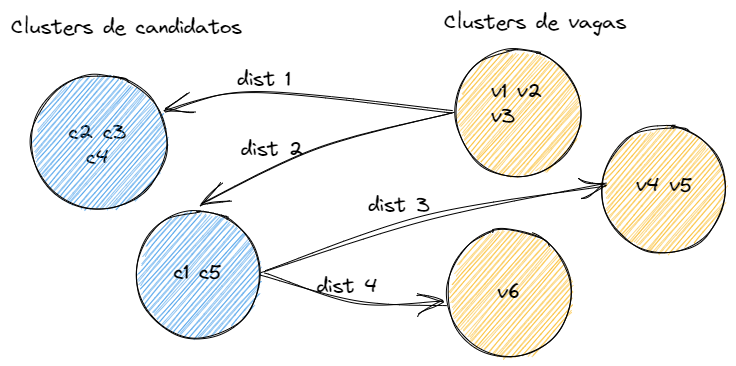

# Match do emprego

## Problema
Melhorar o matching entre as vagas de emprego oferecidas na rede SINE - Sistema Nacional de Emprego e os trabalhadores que procuram a rede em busca de empregos.

 


---  

## Motivação
Índices de empregabilidade estão muito baixos na rede SINE. Ao realizar o cruzamento entre as vagas ofertadas pela IMO (Intermediação de Mão-de-obra) 
e os dados dos currículos dos trabalhadores cadastrados no SINE não há um índice satisfatório de associação.

**Indicadores**
- Atualmente, apenas 2,6% das contratações do mercado são via SINE
- Baixa efetividade: São necessários 45 atendimentos para cada contratação

**Demais problemas**
- falta de padronização quanto à descrição dos cargos e das competências dos trabalhadores.

**Oportunidades**

- Como poderíamos utilizar as competências sem necessidade de acoplamento com uma CBO  (Código Brasileiro de Ocupação) específico?

**Fontes de dados**

- [https://sineaberto.economia.gov.br/#/](https://sineaberto.economia.gov.br/#/)
- [http://qbqconsulta.fipe.org.br/](http://qbqconsulta.fipe.org.br/)
    - iniciativa para padronização dos dados
- LinkedIn
    - alternativa para enriquecimento dos dados
- Lattes
    - alternativa para enriquecimento dos dados

---

## Instructions for installation
1. Download code from GitHub: [https://github.com/abmorte/match-emprego](https://github.com/abmorte/match-emprego)
2. Create a virtual environment. Example name: .venv 
```
  python -m venv .venv
```
3. Activate this environment: Examples commands below and between ' '
```
  Example in Linux: 'source .venv/bin/activate'
  Example in Windows: '.venv/Scripts/Activate'
```
4. Install libraries in it from requirements.txt:
```
    pip install -r requirements.txt
``` 
 
---
## License
This project is licensed under the terms of the MIT license.